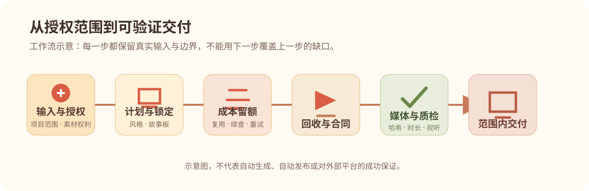

# 质量与验收

## 37 项不是“建议清单”

插件完整保留原杂志插画产线的 37 项一票否决：从未授权发布、音画母钟漂移、字幕可读性、样片与粗剪前置，到来源、动态时长、背景音乐、视觉层级和学生资料话术。共用的安全与交付底线也约束新增风格；杂志独有的画风要求不跨风格硬套。任一适用项命中都应停止推进并报告具体缺口，而不是用“文件已经导出”或“机器检查通过”替代解决。

公开目录在：

```text
plugins/muzhi-video-studio/assets/critical-rules.json
```

它保存每条否决原文、对应源行号、检查路径与来源哈希。运行下列命令会确认 37 条文本、行号、引用文件和重新计算后的源哈希仍一致：

```bash
python -X utf8 <PLUGIN_ROOT>/scripts/verify_rule_coverage.py
```

这项检查只证明规则目录没有被删改，**不**证明一段真实视频已经好看、好听或适合发布。

## 风格与阶段检查

新片先锁定杂志插画或档案电流拼贴，再做分镜和渠道选择。档案电流拼贴的本地样片只证明风格方向可用；试镜中关系线有偏早问题，不能直接当正式镜头通过。每条正式片仍需检查物件动作的前因后果、精确文字的真实来源以及整段的视听节奏。旧杂志项目继续遵守原有风格和已批准版本，不因插件改名重做。



| 阶段 | 检查重点 | 不应被替代为 |
| --- | --- | --- |
| 设计锁 | 已批准的设计资料、真实哈希与引用 | 一个口头“风格差不多” |
| 故事板／批量前 | 完整口播覆盖、语义路由、样片和合同 | 固定镜头数量或静态拼图 |
| 动态回收 | 实际时长、速度、续接、音轨与文件身份 | 文件名或供应商页面文字 |
| 母版前 | 项目合同、QA 证据和完整观看记录 | 一个 `passed: true` 字符串 |
| 发布包 | 认可的母版、适配封面、正确文本与范围 | “成片通过”等同于“已发布” |

计划和检查入口：

```bash
python <PLUGIN_ROOT>/scripts/production_runner.py plan --stage design
python <PLUGIN_ROOT>/scripts/production_runner.py check --project <PROJECT_ROOT> --stage design
python <PLUGIN_ROOT>/scripts/production_runner.py media-audit \
  --project <PROJECT_ROOT> --manifest <PROJECT_ROOT>/artifacts/media-audit.json --decode
```

`media-audit` 需要真实文件和能使用的 ffprobe；完整解码还需要 ffmpeg。缺依赖时，脚本应如实报告，不能假装媒体已经被验证。

## 知识解释与官方证据

新增镜头库先服务口播理解，再进入导演板。流程、比较、因果和概念可以使用本地知识动效机制。人物行为和环境变化才交给图生视频。

院校截图、招生简章、政策条款、学校名和精确数字应保留真实出处。画面可以做局部可读放大、高亮和解释，原文与解释要分清。图生模型不承担精确中文、表格、数字或官方截图。

所有新镜头仍要从当前项目 `design.md` 继承外观。镜头库没有替代字幕阅读检查、来源核验、音画同步或人工观看。

## 人工审查仍不可省略

即使所有脚本返回通过，也应对真实内容检查：

- 口播是否清晰，音乐是否可感知却不压人声；
- 字幕是否在手机尺寸可读，且避让主视觉与解释文字；
- 动作、解释、结论是否与口播关键词同步；
- 是否出现像 PPT、廉价 AI、画风混乱、动画僵硬等否决观感；
- 是否把版权、数据来源、公开授权和平台状态说成已经完成。

用户可以调整本轮审核安排，但代理不能虚构用户看过尚未生成的素材，也不能把“允许直接做”记录成“用户视觉批准”。

## 自动化验证基线

公开包的测试覆盖项目状态、渠道合同、阶段运行器和成本台账，也包含镜头检索、导演前路线、风格适配及公开包边界。原有故事板、动态素材时长和生产合同的负向测试继续保留。具体运行命令见 [GitHub 自动检查配置](../.github/workflows/ci.yml)。测试用于发现已知错误；供应商输出、具体内容和平台状态仍需实际核验。
